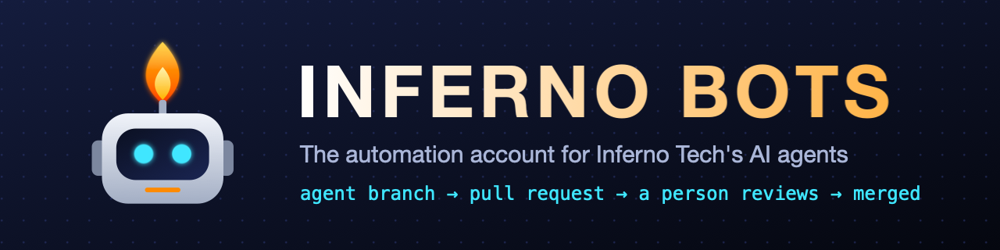

  

### 🤖 What this account is
The automation account for **Inferno Tech's AI agents**. When an agent finishes a piece of work, its changes arrive
from here as a pull request on an agent branch.

### 🔒 How it's kept safe
- Works only on `agent/…` branches, and opens pull requests. **It never merges.**
- A person reviews every change before it lands.
- It acts only on repositories it has been invited to.

### 👋 Need a human?
This account isn't a person. Contact [@prandata](https://github.com/prandata).

AI training on this account's content isn't authorised: see [AI-TRAINING-NOTICE.md](AI-TRAINING-NOTICE.md).
